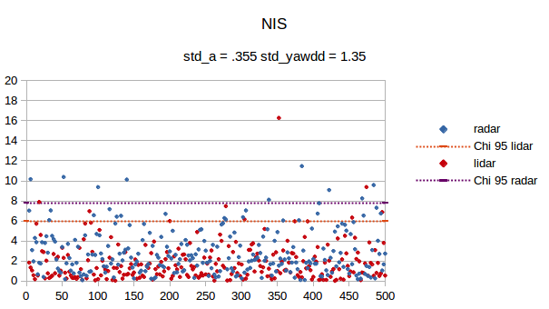

# Unscented Kalman Filter Project Starter Code
Self-Driving Car Engineer Nanodegree Program

---

## Dependencies

* cmake >= v3.5
* make >= v4.1
* gcc/g++ >= v5.4

## Basic Build Instructions

1. Clone this repo.
2. Make a build directory: `mkdir build && cd build`
3. Compile: `cmake .. && make`
4. Run it: `./UnscentedKF path/to/input.txt path/to/output.txt`. You can find
   some sample inputs in 'data/'.
    - eg. `./UnscentedKF ../data/obj_pose-laser-radar-synthetic-input.txt`

## Editor Settings

We've purposefully kept editor configuration files out of this repo in order to
keep it as simple and environment agnostic as possible. However, we recommend
using the following settings:

* indent using spaces
* set tab width to 2 spaces (keeps the matrices in source code aligned)

## About

Maximum accelerations were obtained as follows:

- Typical bicyle acceleration is .71m/s²
- On downhill, maximum speed for 85% of samples is 8.05 m/s
- According to [this paper](https://www.researchgate.net/publication/223922575_Design_speeds_and_acceleration_characteristics_of_bicycle_traffic_for_use_in_planning_design_and_appraisal)
- From tangential velocity, a_cen = yaw_dd = vel_tan²/Radius
- A safe turning radius according to [this link](http://www.dot.state.mn.us/bike/pdfs/manual/Chapter5.pdf) is 24m @ 30km/h (~8.3m/s)

With these parameters, after running, RMSE against ground thruth are:

|Param  |   RMSE    | Unit
|:---|:---:| ---:  |
|x   |   0.0609044  | m   |
|y   |   0.0906175  | m   |
|v_x |   0.328293   |  m/s |
|v_y |   0.206274   |  m/s |

Final variance on each state value is as follows:

|Param|Variance|units|
|:---|:---:|---:|
|Position x|0.00352902 |m²|
|Position y|0.00556909| m²|
|Linear speed|0.0063964 | m²/s⁴ |
|Angular speed| 0.00313428  | rad/s²|
|Angular acceleration  |0.0392089 | rad²/s⁴|

Normailzed Innovation Squared (NIS) is used to check for consistency, NIS behaves as a
Chi squared distribution, so a bounding value can be obtained from said distribution.

Such analisis returns that for a X% confidence, the value should be lower than y,
as seen in the below graph:

Additionally, an output file for the changes across the state vector and covariance
matrix can be found [here.](./extra/debugg.txt)
A debug file can be generated by setting *debug_= true* in ukf.cpp

An openoffice document is also provided for plot generation and NIS analisys [here.](./extra/Data_Analysis.ods)